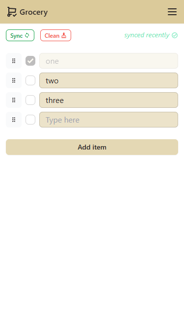
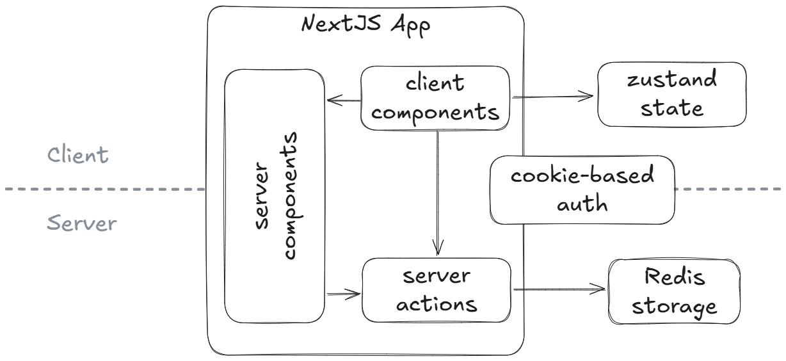

# Grocery

The app allows to create a grocery list synchronised across multiple devices (and possibly users).

## Tech stack

This application is built using the following services and libraries:

- [Next.js](https://nextjs.org) as a foundational framework, the deployment is done
  through [Vercel](https://vercel.com/)
- for styling - [Tailwind CSS](https://tailwindcss.com/) framework with [DaisyUI](https://daisyui.com/) components
- auth system is session-based and implemented with a help of [iron-session](https://github.com/vvo/iron-session)
  library
- for a persistent storage [Redis](https://redis.io/) is used, interfaced
  through [Upstash](https://vercel.com/marketplace/upstash) KV solution for Vercel. Interaction to redis is done with
  the help of [React server actions](https://react.dev/reference/rsc/server-functions#server-functions-with-actions)
- for a client state management [Zustand](https://github.com/pmndrs/zustand) is utilized
- the drag-n-drop functionality is implemented with [dnd kit](https://dndkit.com/) library
- the app is made PWA-ready with [Serwist](https://serwist.pages.dev/)

An overall architecture looks like this:

